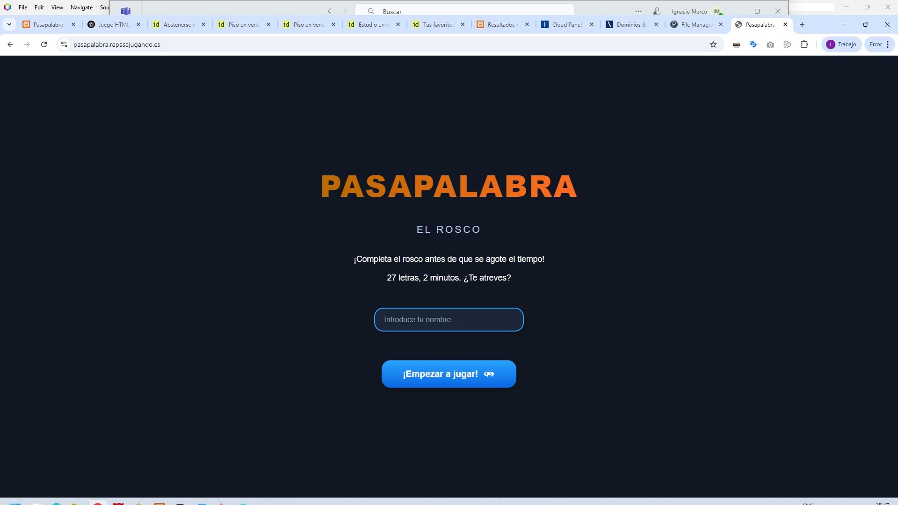

# Pasapalabra · El Rosco



¡Bienvenido/a al clásico juego de preguntas adaptado a **HTML5 + JavaScript ES Modules**! Supera el rosco de 27 letras antes de que se agote el tiempo y compite por entrar en el Top-10 local.


---

## 🎮 Cómo se juega
1. **Introduce tu nombre** en la pantalla de portada y pulsa «¡Empezar a jugar!».  
2. En la pantalla del rosco dispones de **120 segundos** y un panel con la pista actual.  
3. Escribe la respuesta y pulsa **Enviar** (o Enter).  
4. Si no la sabes, pulsa **Pasar** para saltar temporalmente o usa el botón **🎤 Voz** para dictarla (si tu navegador soporta Web Speech API).  
5. Cada acierto colorea la letra en **verde**, cada fallo en **rojo**; las pendientes aparecen en **naranja**.  
6. Al terminar el tiempo o responder todas las letras, se muestra la pantalla de **Resultados** con tu puntuación y el ranking.

### Puntuación
- ✅ Acierto: **+3 puntos**  
- ❌ Fallo: **−1 punto**  
- ⏱️ El tiempo restante no suma ni resta.

---

## 📂 Estructura del proyecto
```
pasapalabra-imc/
├── src/                # Código ejecutable
│   ├── index.html      # Portada
│   ├── game.html       # Rosco + cronómetro
│   ├── results.html    # Ranking y resumen
│   ├── css/
│   │   └── styles.css  # Estilos comunes + variables
│   ├── data/
│   │   └── questions.json   # Banco de preguntas (≥3 por letra)
│   ├── js/
│   │   ├── app.js          # Orquestador de pantallas
│   │   ├── config.js       # Constantes editables (tiempo, colores…)
│   │   ├── dataLayer.js    # Carga JSON + ranking Local Storage
│   │   ├── rosco.js        # Dibujo del rosco en canvas
│   │   ├── timer.js        # Cronómetro
│   │   ├── gameController.js # Lógica de preguntas/respuestas
│   │   ├── utils.js        # Helpers (normalize, score…)
│   │   ├── speech.js       # Dictado por voz (opcional)
│   │   └── results.js      # Render de la pantalla de resultados
│   └── assets/            # Iconos / fuentes opcionales
├── docs/               # Maquetas originales (solo referencia)
├── logs/               # CHANGELOG en SemVer
├── prompts/            # Historial de conversaciones IA
└── README.md           # Este documento
```

---

## 🛠️ Detalles funcionales destacados
- **ES Modules** nativos (no requiere bundler).  
- **100 % offline**: abre `src/index.html` en tu navegador (también desde `file://`).  
- **Cronómetro animado** y rosco responsive (320-1440 px).  
- **Web Speech API** para dictar respuestas (Chrome / Edge / Safari iOS).  
- **Ranking Top-10** persistente en Local Storage (`pasapalabraRanking`).  
- Fácil mantenimiento: ajusta `src/js/config.js` para cambiar duración, alfabeto o colores sin tocar el resto del código.

---

## 🚀 Ejecución local
1. Clona o descarga el repositorio.  
2. Abre `pasapalabra-imc/src/index.html` con doble-click o arrástralo al navegador.  
3. ¡A jugar!

> No se necesita servidor ni dependencias externas.

---

## 📑 Licencia
Proyecto educativo para la práctica de ES Modules, DOM y APIs Web. Puedes usarlo y modificarlo libremente citando la autoría original. 