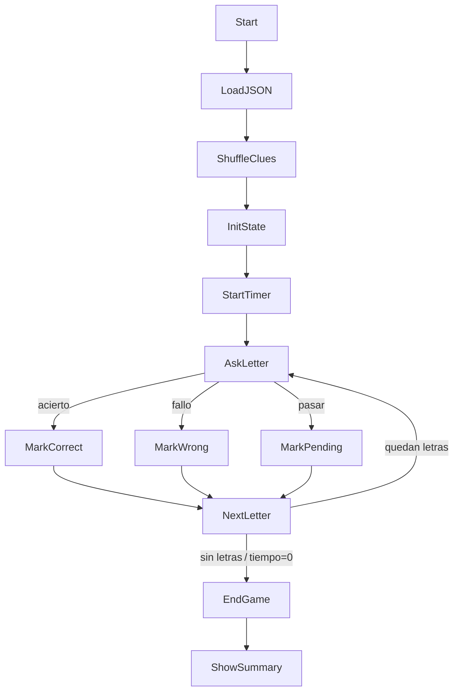

# 📜 Prompt de Desarrollo Completo  
**Juego “Pasapalabra – El Rosco” (versión HTML5 para un solo jugador)**  
*(HTML + CSS + JavaScript + JSON, sin librerías externas)*  

---

## 1. Objetivo  
Crear una versión para navegador y móvil del famoso rosco final de “Pasapalabra”, totalmente funcional, accesible y con un diseño atractivo y moderno. El proyecto debe correr **offline** (solo recursos locales) y estar bien comentado.  
- Sin soporte multi‑idioma (sólo español).  
- Sin efectos de sonido.  

---

## 2. Estructura de carpetas sugerida  

```text
pasapalabra/
├── index.html          # Maquetado principal
├── css/
│   └── styles.css      # Estilos
├── js/
│   └── app.js          # Lógica del juego
├── data/
│   └── questions.json  # Banco de preguntas (≥ 3 por letra)
└── assets/             # Imágenes/íconos opcionales
```

---

## 3. Formato de `questions.json`  

```jsonc
[
  {
    "letter": "A",
    "clues": [
      { "question": "Empieza por A: Capital de Aragón.", "answer": "zaragoza" },
      { "question": "Empieza por A: Mamífero marino con colmillos.", "answer": "morsa" },
      { "question": "Contiene la A: Primer hombre según la Biblia.", "answer": "adan" }
    ]
  },
  ...
]
```

- **≥ 3 pistas** por letra para ofrecer variedad en partidas sucesivas.  
- Respuestas en minúsculas y sin tildes para simplificar la validación.

---

## 4. Requisitos funcionales  

| # | Descripción |
|---|-------------|
| F-01 | Mostrar un rosco circular con las 27 letras españolas (A–Z, Ñ incluida). |
| F-02 | Estados de letra: neutra (azul) → pendiente (naranja) → acertada (verde) → fallada (rojo). |
| F-03 | Cronómetro inicial de 120 s (const `INITIAL_TIME`). |
| F-04 | HUD con tiempo restante, aciertos y fallos. |
| F-05 | Entrada de respuesta por teclado + botón **Enviar**. |
| F-06 | Botón **Pasar** → la letra pasa a pendiente y se continúa. |
| F-07 | Dictado opcional con Web Speech API (si disponible) en español. |
| F-08 | Acertar → verde; fallar → rojo y mostrar solución 2 s. |
| F-09 | Tras la Z se continúa con la primera letra pendiente hasta completar o agotar tiempo. |
| F-10 | Fin de juego: tiempo 0 s o sin letras pendientes. |
| F-11 | Pantalla resumen con estadísticas y botón **Jugar de nuevo**. |
| F-12 | Pantalla especial de victoria si se aciertan las 27 letras antes de acabar el tiempo. |

---

## 5. Usabilidad y diseño  

### 5.1 Responsive  
- **Mobile‑first**; rosco centrado mediante `flex` o SVG `transform:rotate()`.  
- Botones táctiles de ≥ 48 px.  

### 5.2 Accesibilidad  
- Contraste AA (WCAG 2.1).  
- Foco visible (`:focus-visible`).  
- Roles ARIA (`role="timer"`).  

### 5.3 Voice UX  
```js
if ('SpeechRecognition' in window || 'webkitSpeechRecognition' in window) {
  // Mostrar botón micrófono
}
```
- `recognition.lang = 'es-ES'`  
- Indicador visual de grabación (onda, pulso, etc.).  

---

## 6. Lógica principal (`app.js`)  



### Pseudocódigo clave  

```js
import { normalize } from './utils.js';

const letters = [...'ABCDEFGHIJKLMNÑOPQRSTUVWXYZ'];
let pending = [...letters];
let stats   = { hits: 0, fails: 0 };
let current;

function nextLetter() {
  if (!pending.length) return endGame();
  current = pending.shift();
  showClue(current);
}

function handleAnswer(input, passed = false) {
  const clue = getCurrentClue(current);
  if (passed) {
    updateRosco(current, 'pending');
    pending.push(current);
  } else {
    const ok = normalize(input) === clue.answer;
    updateRosco(current, ok ? 'correct' : 'wrong');
    stats[ ok ? 'hits' : 'fails' ]++;
  }
  nextLetter();
}
```

---

## 7. Animaciones y estética  

- Transición `transform:scale(1.2)` al seleccionar letra.  
- Cronómetro circular con `stroke-dasharray` en SVG.  
- Tipografías Google Fonts (ej. *Poppins*); paleta vibrante.  
- Vibración ligera (`navigator.vibrate(60)`) en móvil al acertar/fallar.  
- Sin efectos sonoros por requisito.  

---

## 8. Buenas prácticas de código  

- ES Modules (`type="module"`).  
- `const`/`let`, arrow functions, `async/await`.  
- Separación MVC (modelo preguntas, vista rosco, controlador lógica).  
- Comentarios JSDoc y README detallado.  

---

## 9. Persistencia opcional  

- Guardar récord y partidas jugadas en `localStorage`.  

---

## 10. Checklist para lanzamiento  

- [ ] Chrome, Safari iOS, Firefox, Edge.  
- [ ] Modo avión (offline).  
- [ ] Lighthouse ≥ 90 en Accesibilidad y Performance.  
- [ ] Cronómetro preciso ±100 ms.  
- [ ] Reinicio completo al empezar nueva partida.  

---

## 11. Extensiones futuras (ideas)  

- Ranking en la nube (Firebase).  
- Tema claro/oscuro.  
- Modo “Entrenamiento” sin tiempo.  
- PWA instalable (Service Worker).  
